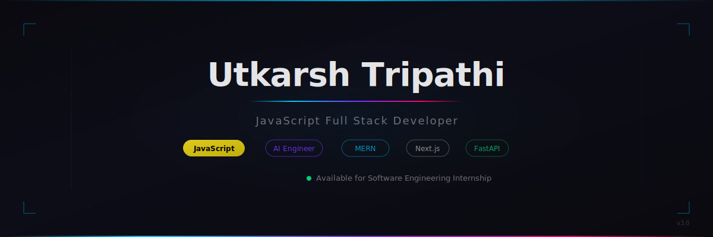
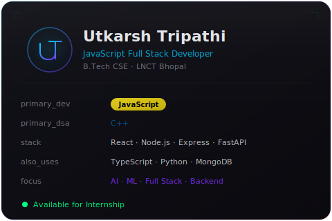
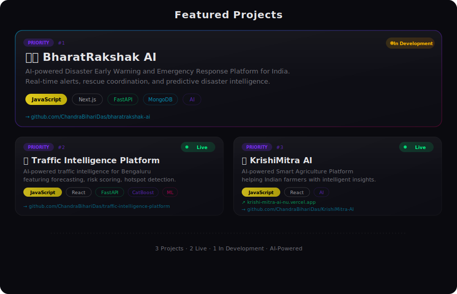
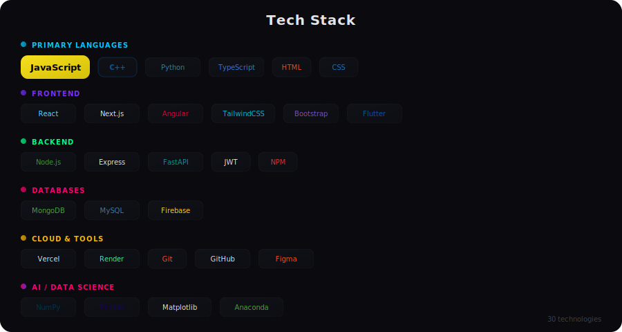
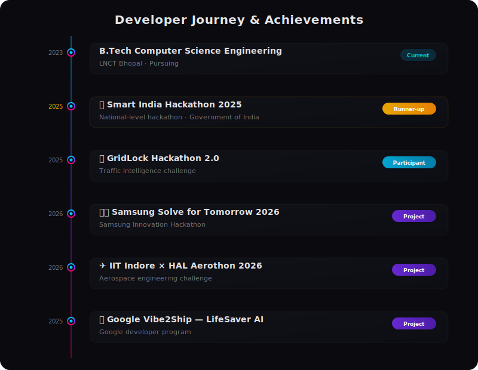

<div align="center">

<!-- HERO BANNER -->


<!-- TYPING SVG -->
<a href="#-about">
  
</a>


[](https://linkedin.com/in/utkarsh-tripathi-a22a97387)
[](mailto:chandrabihari2005@gmail.com)
[](https://mastodon.social/@utkarshtripathi)


**[About](#-about) · [Dashboard](#-developer-dashboard) · [Projects](#-featured-projects) · [Tech Stack](#-tech-stack) · [Stats](#-github-analytics) · [Achievements](#-hackathons--achievements) · [Connect](#-connect)**

</div>

<!-- DIVIDER -->


## 🧠 About

<div align="center">

</div>

> *I build scalable full-stack applications and AI-powered products using JavaScript, TypeScript, Python, and modern backend technologies — solving real-world problems with production-grade code.*

- 🎓 **B.Tech CSE** @ **LNCT Bhopal** · 🥈 **SIH 2025 Runner-up**
- ⚡ **JavaScript** — primary language for full-stack development (MERN)
- 🧮 **C++** — primary language for Data Structures & Algorithms
- 📘 **TypeScript** — used in React & Next.js projects
- 🐍 **Python** — AI, Machine Learning & FastAPI
- 🏗️ Building production-grade AI platforms · Passionate about **Backend Engineering** & **System Design**
- 💼 Actively seeking a **Software Engineering Internship**

<!-- DIVIDER -->


## 💻 Developer Dashboard

```
╭──────────────────────────────────────────────────╮
│                                                  │
│   Developer Dashboard              v3.0          │
│                                                  │
├──────────────────────────────────────────────────┤
│                                                  │
│   Name       : Utkarsh Tripathi                  │
│   Role       : JavaScript Full Stack Developer   │
│   Primary Dev: JavaScript                        │
│   Primary DSA: C++                               │
│   Frontend   : React · Next.js                   │
│   Backend    : Node.js · Express · FastAPI       │
│   Database   : MongoDB · MySQL                   │
│   AI         : Python                            │
│   Status     : Open for Internship               │
│   Building   : BharatRakshak AI 🇮🇳              │
│                                                  │
╰──────────────────────────────────────────────────╯
```

<!-- DIVIDER -->


## 🚀 Featured Projects

<div align="center">

</div>

### 🇮🇳 BharatRakshak AI — *Priority #1*

> AI-powered Disaster Early Warning and Emergency Response Platform for India. Real-time alerts, rescue coordination, and predictive disaster intelligence.

**Tech:** `TypeScript` · `Next.js` · `FastAPI` · `MongoDB` · `AI`


[](https://github.com/ChandraBihariDas/bharatrakshak-ai)

---

### 🚦 Traffic Intelligence Platform — *Priority #2*

> AI-powered Traffic Intelligence for Bengaluru — Demand Forecasting, Incident Intelligence, Risk Scoring, Hotspot Detection, and Analytics Dashboard.

**Tech:** `TypeScript` · `React` · `FastAPI` · `CatBoost` · `Machine Learning`


[](https://github.com/ChandraBihariDas/traffic-intelligence-platform)

---

### 🌾 KrishiMitra AI — *Priority #3*

> AI-powered Smart Agriculture Platform helping Indian farmers with intelligent insights and recommendations.

**Tech:** `HTML` · `CSS` · `JavaScript` · `AI`


[](https://github.com/ChandraBihariDas/KrishiMitra-AI) &nbsp;
[](https://krishi-mitra-ai-nu.vercel.app/)

<!-- DIVIDER -->


## 🧰 Tech Stack

<div align="center">

</div>

<div align="center">


<br/>


</div>

<details>
<summary><b>📂 Full breakdown by category</b></summary>
<br>

**Primary Languages**


**Frontend**


**Backend**


**Databases**


**Cloud & Tools**


**AI & Data Science**


</details>

<details>
<summary><b>🤖 AI & Intelligence Stack</b></summary>
<br>

| Domain | Technologies |
|:---|:---|
| Machine Learning | CatBoost · Scikit-learn · Predictive Analytics |
| Data Science | NumPy · Pandas · Matplotlib · Anaconda |
| Backend AI | FastAPI · Python · REST APIs |
| Computer Vision | Image Processing · Pattern Recognition |
| Data Intelligence | Risk Scoring · Demand Forecasting · Hotspot Detection |
| LLMs & Prompting | Prompt Engineering · AI Integration |

</details>

<!-- DIVIDER -->


## 📊 GitHub Analytics

<div align="center">


<br/>

<br/>

<br/>


</div>

### 📸 Developer Snapshot

<div align="center">

| Metric | Value |
|:---|:---:|
| 💻 Primary Dev Language |  |
| 🧮 Primary DSA Language |  |
| 🎯 Current Focus |  |

</div>

<!-- DIVIDER -->


## 🛤️ Developer Timeline

<div align="center">

</div>

## 🏆 Hackathons & Achievements

| Year | Event | Result |
|:---:|:---|:---|
| 2025 | 🥈 **Smart India Hackathon 2025** | **Runner-up** — National-level hackathon by Government of India |
| 2026 | 🚦 **GridLock Hackathon 2.0** | **Participant** — Traffic intelligence challenge |
| 2026 | 🇮🇳 **Samsung Solve for Tomorrow 2026** | **Project** — Samsung Innovation Hackathon |
| 2026 | ✈️ **IIT Indore × HAL Aerothon 2026** | **Project** — Aerospace engineering challenge |
| 2026 | 🌍 **Google Vibe2Ship — LifeSaver AI** | **Project** — Google developer program |

> 💡 *Only verified, substantiated achievements are listed.*

<!-- DIVIDER -->


## 🌍 Open Source

<div align="center">

> I enjoy contributing to practical developer tools, AI applications, and open-source projects. My goal is to become an active contributor to impactful communities while continuously improving my engineering skills.

<!-- Contribution Snake -->
<picture>
  <source media="(prefers-color-scheme: dark)" srcset="https://raw.githubusercontent.com/ChandraBihariDas/ChandraBihariDas/output/github-snake-dark.svg" />
  <source media="(prefers-color-scheme: light)" srcset="https://raw.githubusercontent.com/ChandraBihariDas/ChandraBihariDas/output/github-snake.svg" />
  
</picture>

</div>

<!-- DIVIDER -->


## 🖥️ Developer Terminal

```javascript
// utkarsh.config.js

const developer = {
  name: "Utkarsh Tripathi",
  role: "JavaScript Full Stack Developer",
  identity: "AI Engineer",
  education: "B.Tech CSE — LNCT Bhopal",

  languages: {
    primaryDev: "JavaScript",    // Full-stack development
    primaryDSA: "C++",           // Data Structures & Algorithms
    secondary: "TypeScript",     // React & Next.js projects
    ai: "Python",                // AI, ML, FastAPI
  },

  stack: {
    frontend: ["React", "Next.js", "Angular", "TailwindCSS"],
    backend: ["Node.js", "Express", "FastAPI"],
    databases: ["MongoDB", "MySQL", "Firebase"],
    ai: ["CatBoost", "NumPy", "Pandas", "Matplotlib"],
  },

  projects: {
    flagship: "BharatRakshak AI 🇮🇳",
    live: ["Traffic Intelligence Platform", "KrishiMitra AI"],
  },

  achievements: {
    "SIH 2025": "Runner-up 🥈",
    hackathons: 5,
  },

  status: "Available for Software Engineering Internship",
  motto: "Building AI-powered solutions for real-world problems",
};

module.exports = developer; // Ship it. 🚀
```

<!-- DIVIDER -->


## 🤝 Connect

<div align="center">

[](https://linkedin.com/in/utkarsh-tripathi-a22a97387)
[](mailto:chandrabihari2005@gmail.com)
[](https://mastodon.social/@utkarshtripathi)
[](https://github.com/ChandraBihariDas)

| | |
|:---|:---|
| 🔭 Working on | BharatRakshak AI — Disaster Response Platform |
| 🌱 Learning | Advanced System Design · Cloud Architecture |
| 👯 Collaborate on | AI-powered projects · Hackathons · Open Source |
| 💬 Ask me about | JavaScript · React · Node.js · C++ · FastAPI · MongoDB |
| 📫 Reach me at | chandrabihari2005@gmail.com |

</div>

<details>
<summary>❓ What's my ideal internship?</summary>
<br/>
A hands-on full-stack or backend role where I can learn from experienced engineers, ship real features, and grow fast. I'm especially interested in teams building AI-powered products.
</details>

<details>
<summary>❓ Why JavaScript as primary?</summary>
<br/>
JavaScript is the language of the web. It powers everything from frontend interactions to full backend services via Node.js. I use JavaScript for the MERN stack and reach for TypeScript when a project benefits from static typing — especially in React and Next.js codebases. C++ handles my competitive programming and DSA needs.
</details>

<!-- DIVIDER -->


<!-- FOOTER -->
<div align="center">


⭐ **Star my repos if you find them useful** · *Always happy to connect and build something new.* 🚀


</div>
