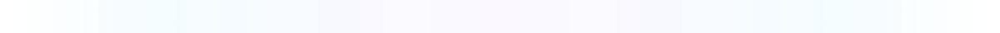

# 👁️ Assets Preview

Visual preview of all SVG assets in the repository. Use this page to verify the design language is consistent across all assets.

---

## Logo

---

## Banner

---

## Background

---

## Divider

---

## Footer

---

## Profile Card

---

## Timeline

---

## Projects

---

## Tech Icons

---

## Design Language Checklist

| Check | Status |
|:---|:---:|
| Same typography across all SVGs | ✅ |
| Same gradient colors (#00C9FF → #7B2FFF → #FF006E) | ✅ |
| Same background color (#0A0A0F) | ✅ |
| Same border radius (16px cards, 12px chips) | ✅ |
| Same glow effects (Gaussian blur) | ✅ |
| Same text colors (#E4E4E7 primary, #71717A secondary) | ✅ |
| JavaScript visually emphasized | ✅ |
| No raster images | ✅ |
| Reusable symbols used | ✅ |
